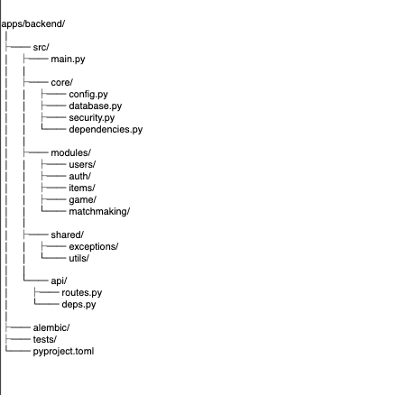
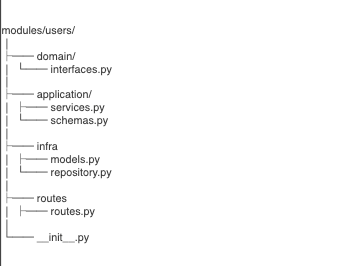

## Hi there 👋

**Requiem Sys** é um sistema desenvolvido para a gestão do cemitério municipal de Carapicuíba, com foco em organização, controle e eficiência dos processos administrativos.

A aplicação segue uma arquitetura de monólito modular dentro de um monorepo, integrando backend e frontend em uma única base de código. No backend, os módulos são organizados por domínio — como gestão de sepultamentos, registros, usuários e operações — garantindo separação de responsabilidades e facilidade de manutenção.

O sistema tem como objetivo centralizar informações, otimizar o acesso a dados e modernizar a administração do cemitério, utilizando boas práticas de engenharia de software, com uma base escalável e preparada para evoluções futuras.

### backend structure:

### modules structure:

<!--
**RequiemSys/RequiemSys** is a ✨ _special_ ✨ repository because its `README.md` (this file) appears on your GitHub profile.

Here are some ideas to get you started:

- 🔭 I’m currently working on ...
- 🌱 I’m currently learning ...
- 👯 I’m looking to collaborate on ...
- 🤔 I’m looking for help with ...
- 💬 Ask me about ...
- 📫 How to reach me: ...
- 😄 Pronouns: ...
- ⚡ Fun fact: ...
-->
